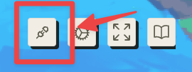
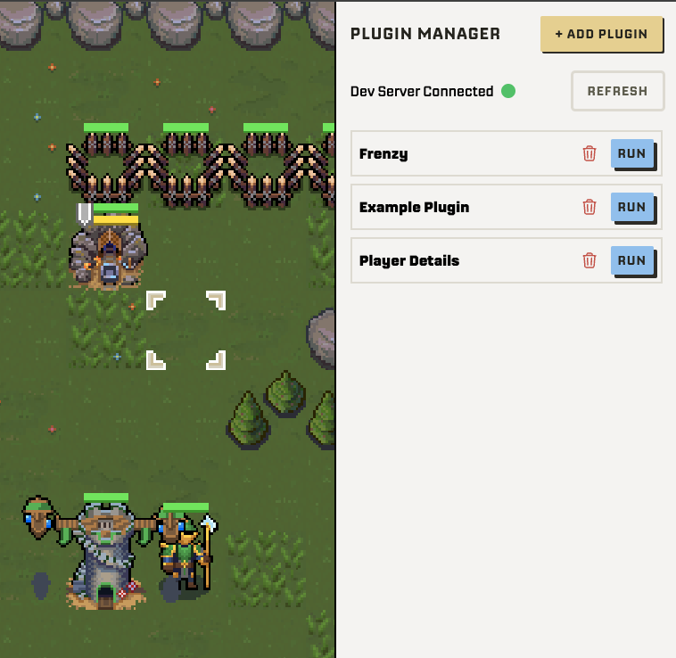
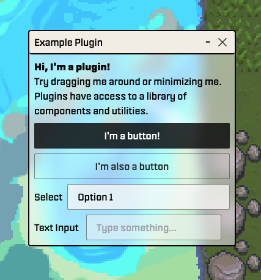

# Sky Strife Plugins

Plugins are client-side code that players can run in the Sky Strife client to modify their gameplay experience. Full access is given to Sky Strife's internal client API.

  
You can open the Plugin Manager using the button in the upper-right of the Sky Strife client.

  
Here you can add, remove, or run your plugins.

  
Each plugin receives it's own movable window to render into.

## Getting Started

When you [deploy SkyStrife according to the README.md](../../README.md#initial-dev-setup), the plugin dev server is automatically started for you.
When you edit any files in your [`dev`](./dev) folder, they will be available in your Plugin Manager.

Plugins must implement this interface:

```typescript
function createPlugin(pluginLayer: PluginLayer) {
  // Code here will be run on plugin initialization

  return {
    // Called when a plugin is run
    mount: (container: HTMLDivElement) => {},
    // Called when a plugin is stopped or destroyed
    // Use this to clean up anything your plugin has setup
    // i.e. hotkeys, in-game visuals
    unmount: () => {},
  };
}
```

You can view the `PluginLayer` API [here](../client/src/layers/Plugins/createPluginLayer.ts).

## Examples

There are some example plugins provided in the client by default.
The purpose of these is to introduce players to what is possible with a plugin and inspire them to create their own.
Currently, the examples are:

1. [UI Example](tutorials/uiExample.md): This example is used to show all of the built-in UI components provided by plugins.
   You can use this as a starting point for a new plugin.
1. [Player Details](tutorials/playerDetails.md): Display a more detailed view of a player in your match.
   This introduces fetching data that is not otherwise shown in the Sky Strife UI.
1. Frenzy: Provides a hotkey that commands one of your units to attack the nearest enemy automatically.
   It has a small informational UI and also highlights the intended target in-game.
   This is a good introduction to gameplay plugins as it accesses enemy unit information, does some calculations, and issues an attack transaction on behalf of the user.

## Plugin API

Plugins are provided with a simplified API for interacting with the Sky Strife client.

## UI Development in Plugins

The recommended way of creating plugin UIs is by using the provided [Preact](https://preactjs.com/) framework.
Preact is a stripped-down version of [React](https://react.dev/) that is embeddable in the Sky Strife client.
If you are familiar with React then you can easily get started using Preact, as they use mostly the same API.

One complication of plugin development is that `jsx` files are not available.
Instead, we use [htm](https://github.com/developit/htm), a `jsx` alternative using template strings.

Here is a full example of using Preact and htm to create a simple plugin:

```typescript
// WARNING: Only types may be imported here.
import type { PluginLayer } from "client/src/layers/Plugins/createPluginLayer";

/**
 * Plugins must define a function named `createPlugin` that takes `PluginLayer`
 * and returns an object with `mount` and `unmount` methods.
 */
function createPlugin(pluginLayer: PluginLayer) {
  const {
    ui: {
      preact: {
        html,
        render,
        h,
        hooks: { useState },
      },
      components: { Button },
    },
  } = pluginLayer;

  return {
    // Called when the plugin is first loaded.
    mount: (container: HTMLDivElement) => {
      function App() {
        const [counter, setCounter] = useState(0);

        return html`<div>
          <p>Counter: ${counter}</p>

          <${Button} buttonType="primary" label="Click me to increment" onClick=${() => setCounter((c) => c + 1)} />
        </div>`;
      }

      render(h(App, {}), container);
    },
    unmount: () => {},
  };
}
```

## Plugin Deployment

If you are done writing a plugin and want to give access to others, you'll have to host it somewhere that offers static file hosting.

The easiest way to do this is to [create a gist on GitHub](https://docs.github.com/en/get-started/writing-on-github/editing-and-sharing-content-with-gists/creating-gists). This allows you to make one file publicly accessible.

Once hosted in this way, you can give others the link to the plugin and they can import it into their client.

[Here is an example of plugin in a gist.](https://gist.github.com/Kooshaba/d5b430dd44dc0da4fb2b0171eb7b6004)

## Security Considerations

> Plugins have FULL access to the Sky Strife client.
> This means they have access to the **private key of your session wallet**.
> Malicious plugins could steal this key, steal any ETH in your session wallet, or take control of your units in a match.

That being said, the attack surface of your session wallet key is limited.
There should only ever be a small amount of ETH in your session wallet, and if you've suspected that it is compromised you can revoke the existing session wallet and generate a new one easily.
