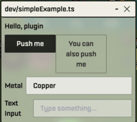

# uiExample.ts explanation

Here is the detailed explanation for [this plugin](../dev/uiExample.ts).
This is an extremely simple plugin that just shows a user interface.



## The source code

```typescript
// WARNING: Only types may be imported here.
import type { PluginLayer } from "client/src/layers/Plugins/createPluginLayer";
```

Import the plugin API.

```typescript
/**
 * Plugins must define a function named `createPlugin` that takes `PluginLayer`
 * and returns an object with `mount` and `unmount` methods.
 */
function createPlugin(pluginLayer: PluginLayer) {
  const {
    ui: {
      preact: { html, render, h, hooks },
      components: { Button, Select, TextInput },
    },
  } = pluginLayer;
```

The plugin UI is based on [Preact](https://preactjs.com/), which is similar to React but less resource intensive.

The Sky Strife UI library currently provides these components:

- Button
- Highlight
- Select
- Sprite
- TextInput

```typescript
function Spacer() {
  return html`<div style=${{ height: "8px" }}></div>`;
}
```

To create a new component, create a function that returns the [HTM (JSX alternative used by Preact)](https://preactjs.com/guide/v10/getting-started/#alternatives-to-jsx) for it.

```typescript
  return {
    // Called when the plugin is first loaded.
    mount: (container: HTMLDivElement) => {
      function App() {
```

The `App` component is the top level of the plugin.

```typescript
const [metal, setMetal] = hooks.useState<"Cu" | "Ag" | "Au">("Cu");
const [textInputValue, setTextInputValue] = hooks.useState("");
```

The Preact [`hooks.useState`](https://preactjs.com/guide/v10/hooks/#usestate) is used to create state variables, similar to the React `useState`.

```typescript
        return html`<div style=${{ maxWidth: "320px", display: "flex", flexDirection: "column" }}>
          <h2>Hello, plugin</h2>

          <${Spacer} />

          <div>
```

To put multiple components on the same line, wrap them in [a `div` tag](https://developer.mozilla.org/en-US/docs/Web/HTML/Element/div).

```typescript
            <${Button}
```

Preact uses [tagged template literals](https://developer.mozilla.org/en-US/docs/Web/JavaScript/Reference/Template_literals), so `${Button}` is the `Button` component function.

```typescript
              ...${{
                buttonType: "primary",
                label: "Push me",
                style: { width: "40%" },
                onClick: (event) => alert(event.srcElement.innerText),
```

This is the way you specify the function to be called when the button is clicked.

```typescript
              }}
            />

            <${Button}
              ...${{
                buttonType: "secondary",
                label: "You can also push me",
                style: { width: "40%" },
                onClick: () => alert(`Metal: ${metal}\nText field: ${textInputValue}`),
```

To read the state variables you use the first value in the list returned by [`hooks.useState`], similar to React.

```typescript
              }}
            />
          </div>

          <${Spacer} />

          <${Select}
```

This is the way to let the user select from a list.

```typescript
            ...${{
              label: "Metal",
              options: [
                { value: "Cu", label: "Copper" },
                { value: "Ag", label: "Silver" },
                { value: "Au", label: "Gold" },
              ],
              value: metal,
              onChange: (value: string) => setMetal(value as "Cu" | "Ag" | "Au"),
```

The second item in the `hooks.useState` return value is the function to change the state variables.

```typescript
              style: { width: "100%" },
              containerStyle: { width: "100%" },
            }}
          />

          <${Spacer} />

          <${TextInput}
            ...${{
              label: "Text Input",
              value: textInputValue,
              placeholder: "Type something...",
              onChange: (value: string) => setTextInputValue(value),
              style: { width: "100%" },
            }}
          />
        </div>`;
      }
```

End of the `App` component function.

```typescript
render(h(App, {}), container);
```

Create a virtual DOM object [using `h`](https://preactjs.com/guide/v10/api-reference/#h--createelement) for the `App` component we just defined and [`render`](https://preactjs.com/guide/v10/api-reference/#render) it.

```typescript
},
```

End of the `mount` function, which is called when the plugin is started.

```typescript
    // Called when a user manually stops the plugin
    // or when plugin code is updated.
    // Use this to clean up any resources or event listeners
    // that you set up during mount.
    // eslint-disable-next-line @typescript-eslint/no-empty-function
    unmount: () => {},
```

We don't need to do anything here, if we had registered event listeners we'd have to unregister them.

```typescript
  };
}
```
